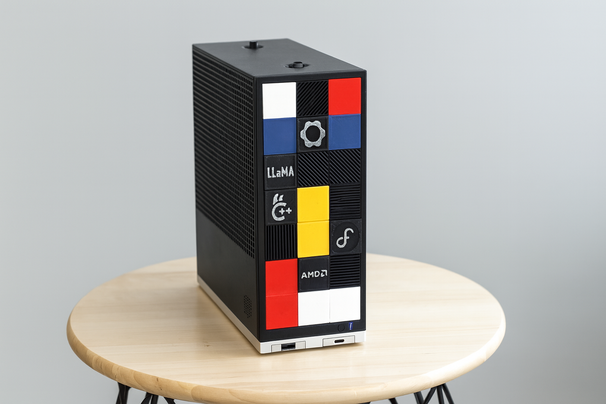
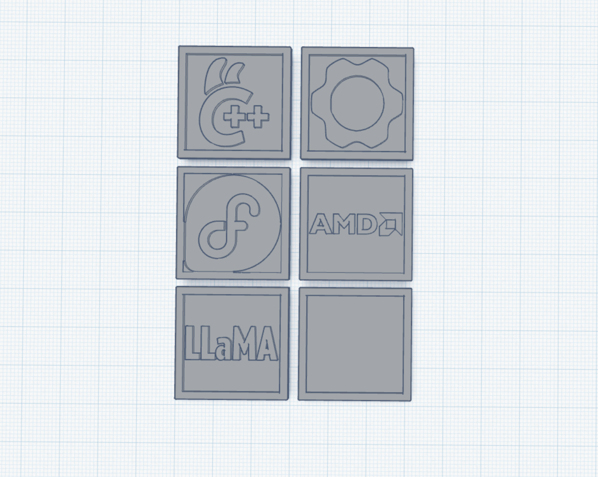

# Framework Desktop – Custom Front Tiles

These are custom 3D-printed front tiles for the [Framework Desktop](https://frame.work/), as shown at **minute 2:53** in my [YouTube video](https://youtu.be/7-E0a6sGWgs).  

---

## Files

- `framework tiles - front.stl`  
- `framework tiles - back.stl`   (taken rom https://www.printables.com/model/1207702-framework-desktop-lego-compatible-tile)
- `tiles.png` – raw front tile designs from Tinkercad  

---

## Printing Notes

- The tiles are split into **front** and **back** STL files.  
  - This makes them easy to print **flat on the bed without supports**.  
  - Once printed, simply **glue the front and back together**.  
- Some tiles feature protruding details (logos, text, etc.).  
  - I used a **Uniposca silver marker** to highlight the raised parts.  

---

## Preview

---

## Video

For full context and a look at the tiles in use, check out my video:  
➡️ [Run Qwen Image and WAN 2.2 on Framework Desktop with Strix Halo (AMD AI Ryzen MAX+ 395) - Full Guide](https://youtu.be/7-E0a6sGWgs)

---
